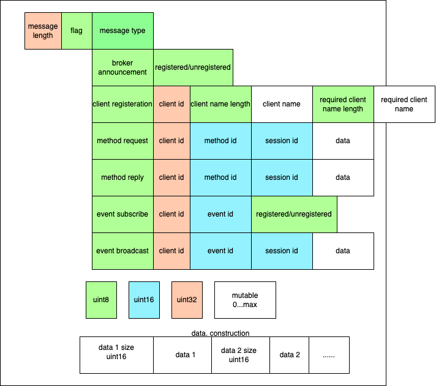
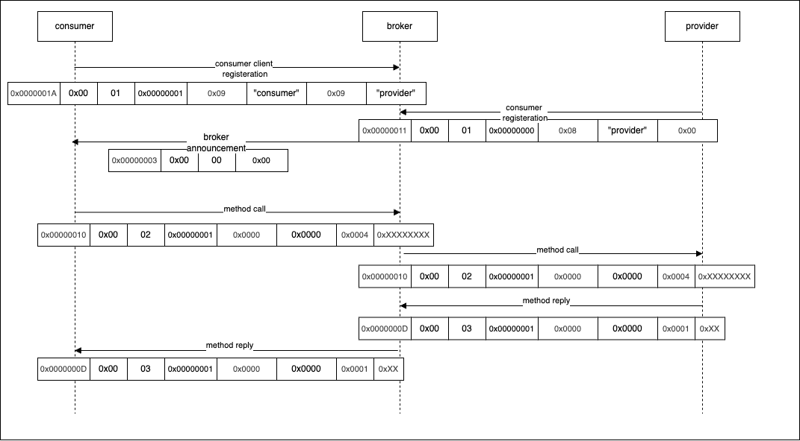
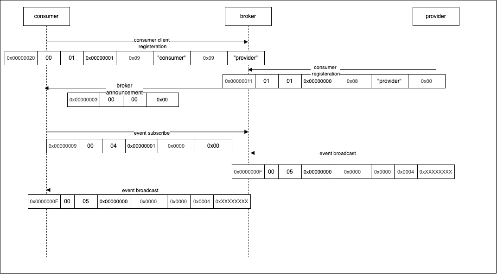

# Protocol Definition

## Purpose

The purpose of this protocol is to define a way of handling service oriented programing using tcp/ip.
Communication is handled between clients through a broker in between.
Types of clients that will communicate is either consumer or provider.
Consumer is counted as a client which will use some service.
Provider is counted as the service which will provide some functionality to be used by multiple consumers.

## Protocol

All data inside the protocol will follow big endian format however the endianes of the machine.

### Message Header

- Message length:
    - This is the total message including the rest of the header and the message content.
    - It is of type uint32.

- flag:
    - Type uin8.
    - flag used to define payload, if it is encrypted, signed or compressed.

- Message type:
    - Message type defines the content of the message after the header and how it will be parsed.
    - It is of type uint8
    - Representations are :
        - broker announcement  = 0x00
        - client registeration = 0x01
        - method request       = 0x02
        - method reply         = 0x03
        - event subscribe      = 0x04
        - event broadcast      = 0x05

### Message Content

Message content will depend on the message type, different message types contains different message content and payload.

- Broker announcement:
    - It is used to announce for different clients the current registered or unregistered clients.
    - Content is only a uint8 payload describing for intersted clients of the provider they are intersted in is found or not.
        - Registered   = 0x00, means provider is valid and can be used.
        - Unregistered = 0x01, means provider is invalid and consumer clients can no longer use it.

- Client registeration:
    - It is used to register a client either as a consumer or provider depending on the content and payload.
    - Content is :
        - Client id:
            - Type uin32
            - The id of the client which is registering and it must be a unique id, which is not used by other clients.
        - Client name length:
            - Type uint8
            - The length of the name of the client which is registering.
        - Client name
            - Type string with variadic size with max 255 bytes
            - The name of the client which is registering, if this client is a provider client, then this name will be used
              by the consumer clients to find the id and link the messages.
            - If this was a provider and a consumer client was already registering before it was registered for this client,
              then a broker announcement will be done and link will be handled by the broker.
        - Needed client name length:
            - Type uint8
            - The length of the name of the provider client that the registering client is intersted at.
        - Needed client name(optional):
            - Type string with variadic size with max 255 bytes
            - Optional:
                - Exists, if the registering client is a consumer of another provider client, then this is the name of the
                  provider.
                - Does not exist, if this is only a provider client and is not intersted of other clients.

- Method request:
    - It is used to request a method call from a consumer to a provider.
    - Content is:
        - client id:
            - Type uint32
            - It is the id used for registering the consumer client which calls the method.
        - method id:
            - Type uint16.
            - It is the id which map to specific method, each method defined for the client is unique.
            - It shall be mapped with same id for the method requested from the provider.
        - session id:
            - Type uint16.
            - Unique per each new request, incrementing per request.
            - It is used to map same request, incase payload was larger than max buffer and was splitted into multiple frames.
            - It is used for the reply message type to map to the request correctly.
        - Data(optional):
            - It is used to send data between consumer and provider.
            - It is variadic, a method can have multiple data or even non.
            - If method pass some data, then data is defined as follow:
                - data length:
                    - uint16
                    - describing the size of the data.
                - data:
                    - variadic, its size depend on the data length.
- Method reply:
    - It is used as a reply of a method call from a provider to conusmer.
    - Content is:
        - client id:
            - Type uint32
            - It is the id of the consumer which requested the method previously.
        - method id:
            - Type uint16.
            - It is the id which map to specific method, each method defined for the client is unique.
            - It shall be mapped with same id for the method requested from the provider.
        - session id:
            - Type uint16.
            - Same session id used in the method request.
        - Data(optional):
            - It is used to send data between consumer and provider.
            - It is variadic, a method can have multiple data or even non.
            - If method replies with some data, then data is defined as follow:
                - data length:
                    - uint16
                    - describing the size of the data.
                - data:
                    - variadic, its size depend on the data length.

- Event subscribe:
    - It is used by a client to listen and subscribe on a specific event from a provider.
    - Content is:
        - Event id:
            - Type uint16
            - It is the id to identify which event client is intersted at.
        - Registeration type:
            - Registered   = 0x00.
            - Unregistered = 0x01.
            - Type uin8.
- Event broadcast:
    - It is used as a broadcast from a provider to all subscribing consumers.
    - Content is:
        - Event id:
            - Type uint16.
            - It is the id which map to specific event, each event defined for the client is unique.
            - It shall be mapped with same id for the event subscribed from consumer.
        - session id:
            - Type uint16.
            - Used per each event broadcast to identify the session and the fragementations.
        - Data(optional):
            - It is used to send data between consumer and provider.
            - It is variadic, a method can have multiple data or even non.
            - If method replies with some data, then data is defined as follow:
                - data length:
                    - uint16
                    - describing the size of the data.
                - data:
                    - variadic, its size depend on the data length.

